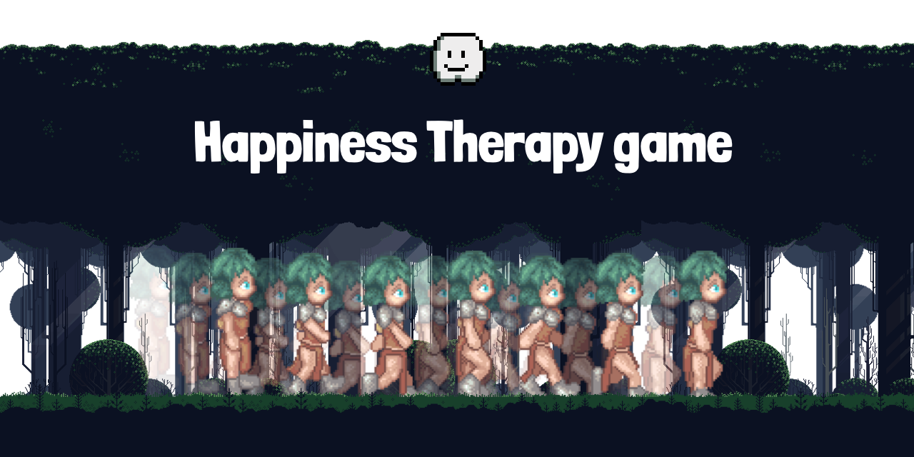

# Happiness Therapy Game

## Context

This game project was realized in 4 days as part of an intensive training bootcamp at Ironhack to become Fullstack JS web developer.

## Rules

You've just entered Abby's mind.
It's a little bit dark down here.
As you can see around you, Abby might have the blues..
You're main mission is to help Abby collect good thoughts and avoid dark ones to fill the happiness gauge to 100%.
You can use right & left keyboard key to move and the space bar to jump.

Made with love in Paris!
Enjoy!
